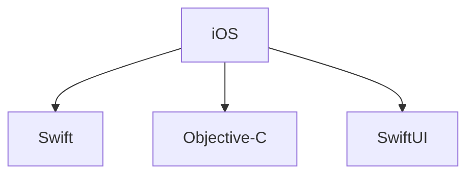
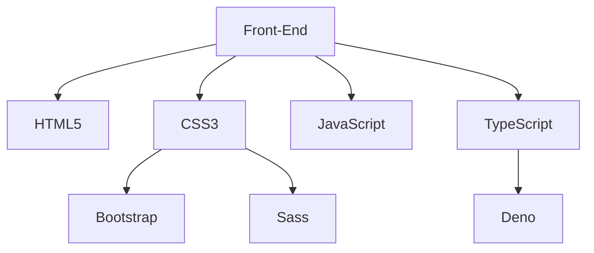
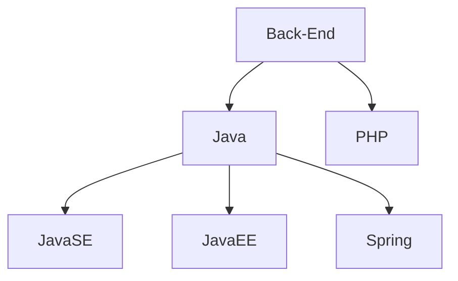
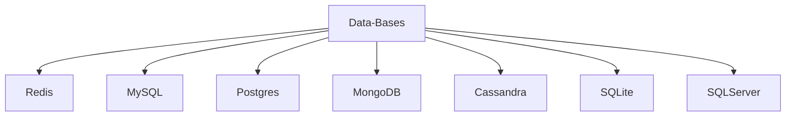

<!--
**Victor-A-P/Victor-A-P** is a ✨ _special_ ✨ repository because its `README.md` (this file) appears on your GitHub profile.

-->
# Hi I am Víctor A. Pacheco 👋
<!---------------------------------------------------------------------------------------------------------------------------------------------------------------------------------------------------------------->


<!---------------------------------------------------------------------------------------------------------------------------------------------------------------------------------------------------------------->

## About me:

I graduated from a technical school as a technician in Programing and currently I am studying
a dregree of ingeniering in informatics and I am searching for the oportunity to further develop
my skills in web application, and in the development and administration of data bases.

I am passionate with a continuous for learning at the moment I am learning new things about data
science and front-end development focusing in UX and UI.

### - 🔭 I’m currently working on ...

```
At the moment I am working in a personal
project wich is the development of apps
for mobile devices using iOS with Swift
```
<a href="https://developer.apple.com/learn/" target="_blank"></a>

<br>

### - 🌱 I’m currently learning ...

```
Currently with the help of freecodecamp
I am improving my abilities in JS and responsive desing.
```
<a href="https://www.freecodecamp.org/learn/" target="_blank"></a>

<br>

```
Because of my curiousity I wanted to know about game developement that is when I found about Godot
wich is a great tool and thanks to the courses of GDquest I am having a blast learning abaut this tool.  
```
<a href="https://www.gdquest.com/" target="_blank"></a>

<br>

```
In this is the page that I am learning about Swift and other various courses.  
```
<a href="#" target="_blank"></a>

<br>

```
Right now thanks to a course in Cisco Skills for all I am able to learn about python
```
<a href="#" target="_blank"></a> <a href="https://img.shields.io/badge/python-3670A0?style=for-the-badge&logo=python&logoColor=ffdd54" target="_blank"></a>  

<br>

### - 👀 I’m interested in ...
    - UX --> I like to look for the new changes that each update of CSS bring us and see how it afects the way a web page 
             it's more accesible to more people.
             
    - UI --> One of the web desing trends that I am interested is in "Bento Box".
    
    -  🎨 Arts --> I like a various forms of arts such as: 
                      - Photographie
                      - Street art (Murals and graffitti)
                      - Branding  (Logos & typographie)
            
    -  🏈 --> And related to sports I am a huge fan of football & have played in different positions, so I am very 
              pasionate about it.

<br><br>
<!--
## #30NitesOfCode:
  [Check out my progress!](https://www.codedex.io/@Al3X4NDR0S/30-nites-of-code)  
  

  <br><br>
    
<!---------------------------------------------------------------------------------------------------------------------------------------------------------------------------------------------------------------->
<!--
[](https://github.com/Victor-A-P/github-readme-activity-graph)

<!---------------------------------------------------------------------------------------------------------------------------------------------------------------------------------------------------------------->
<!--
<div align="center">  
   
  
  
</div> 

<!---------------------------------------------------------------------------------------------------------------------------------------------------------------------------------------------------------------->
<!--

https://github.com/marketplace/actions/generate-snake-game-from-github-contribution-grid
-->
<!---------------------------------------------------------------------------------------------------------------------------------------------------------------------------------------------------------------->

## 🖥️ My Skills

### iOS Development


<p align="center">
  <a href="#">
    
  </a>
</p>

### Front-end


 

<p align="center">
  <a href="#">
    
  </a>
</p>

  <!--
  
  -->

<br>

### Back-end




<p align="center">
  <a href="#">
    
  </a>
</p>

<br>

### Data-Bases




<p align="center">
  <a href="#">
    
  </a>
</p>

<!--
postgrade, mongodb,gcp,azure,aws
-->

<!----------------------------------------------------------------------------------------------------------------------------------------------------------------------------------------------------------------->

## 💼 Lenguagues that I have used

<br>
<p align="center">
  <a href="#">
    
  </a>
</p>
<!--
swift, spring, sass, rust, ruby,nodejs, go, flask,angular 
-->
<br>

## 🛠️ Tools / Apps that I have used

<br>
<p align="center">
  <a href="#">
    <br>
    <br>
    <br>
    <br>
    <br>
  </a>
</p>
<br>

<!---------------------------------------------------------------------------------------------------------------------------------------------------------------------------------------------------------------->

## 📫 How to contact me: 

<div align='center'>
  <br>
  <a href="https://www.linkedin.com/in/victoralejandropachecogarcia/" target="_blank"></a>&nbsp;&nbsp;                                                                          
  <a href="mailto:victor.alejandro.ph@gmail.com?Subject=Contacting%20you%20from%20Github:" ></a>&nbsp;&nbsp;                                                                               
  <a href="mailto:victor.pacheco.ph@outlook.com?Subject=Contacting%20you%20from%20Github:" ></a>&nbsp;&nbsp;
  <br>
  <a href="https://twitter.com/Victor_A_P_G" target="_blank" ></a>&nbsp;&nbsp;
  <br>
</div>
