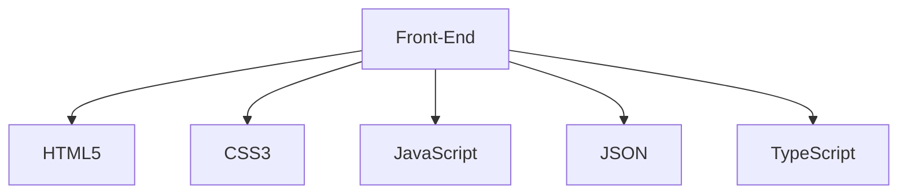
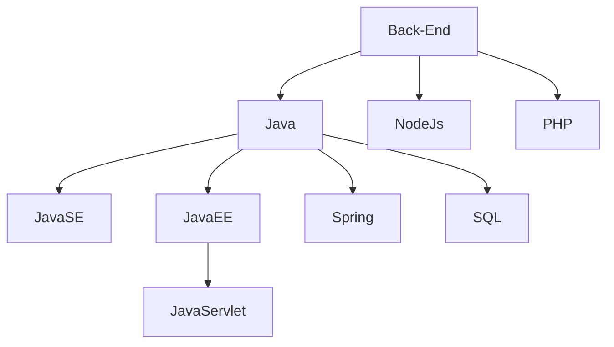
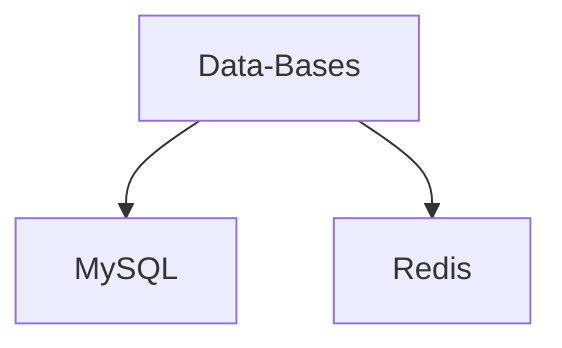

<!--
**Victor-A-P/Victor-A-P** is a ✨ _special_ ✨ repository because its `README.md` (this file) appears on your GitHub profile.

-->
# Hi I am Víctor A. Pacheco 👋
<!---------------------------------------------------------------------------------------------------------------------------------------------------------------------------------------------------------------->

<!---------------------------------------------------------------------------------------------------------------------------------------------------------------------------------------------------------------->

## About me:

### - 🔭 I’m currently working on ...
### - 🌱 I’m currently learning ...
  
  
  
  

  

    

 <!--
  

  

  
  
-->
### - 👀 I’m interested in ...
  - UX
  - UI
  -  🎨 Arts
  -  🏈
<!---------------------------------------------------------------------------------------------------------------------------------------------------------------------------------------------------------------->

<!---------------------------------------------------------------------------------------------------------------------------------------------------------------------------------------------------------------->

  
   
  
  

 

<!---------------------------------------------------------------------------------------------------------------------------------------------------------------------------------------------------------------->
<!--

https://github.com/marketplace/actions/generate-snake-game-from-github-contribution-grid
-->
<!---------------------------------------------------------------------------------------------------------------------------------------------------------------------------------------------------------------->

## 🖥️ My Skills

### Front-end

  

  <!--
    
  -->

 

### Back-end

  

 

### Data-Bases

  

<!--
postgrade, mongodb,gcp,azure,aws
-->

<!----------------------------------------------------------------------------------------------------------------------------------------------------------------------------------------------------------------->

## 💼 Lenguagues that I have used

 

  

<!--
swift, spring, sass, rust, ruby,nodejs, go, flask,angular 
-->
 

## 🛠️ Tools / Apps that I have used

 

  <a href="https://skillicons.dev">
     
     
     
     
  </a>

 
<!--
unreal,jenkins,gamemakerstudio, docker, blender,arduino
-->
<!---------------------------------------------------------------------------------------------------------------------------------------------------------------------------------------------------------------->

## 📫 How to contact me: 

   
  &nbsp;&nbsp;                                                                          
  &nbsp;&nbsp;                                                                               
  &nbsp;&nbsp;
   
  &nbsp;&nbsp;
   

