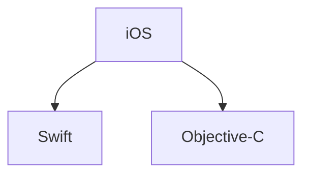
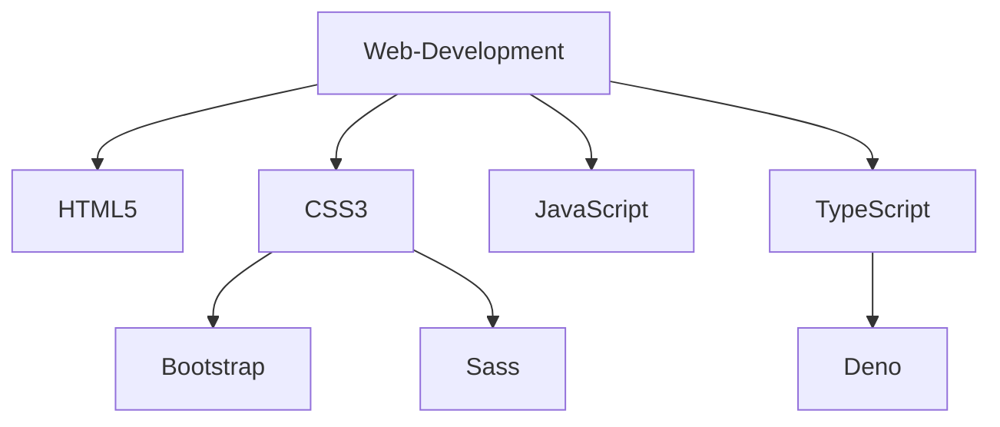
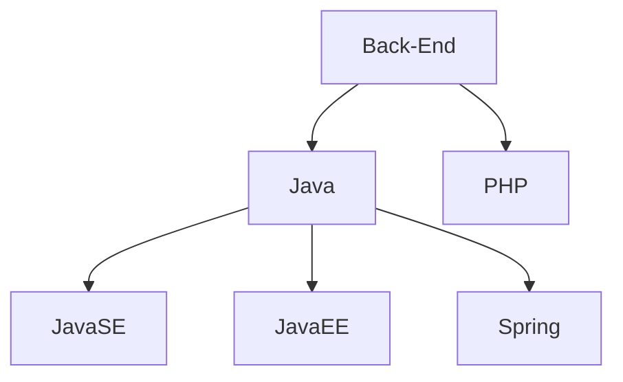
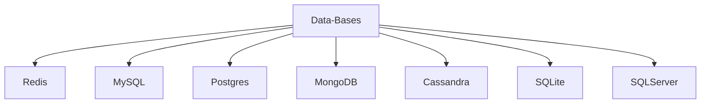

<!--
**Victor-A-P/Victor-A-P** is a ✨ _special_ ✨ repository because its `README.md` (this file) appears on your GitHub profile.

-->
# Hello there! <br><br> I am Víctor A. Pacheco 👋
<!---------------------------------------------------------------------------------------------------------------------------------------------------------------------------------------------------------------->


<!---------------------------------------------------------------------------------------------------------------------------------------------------------------------------------------------------------------->

## About me:
```
I graduated as a Programming Technician and am currently pursuing a degree in Informatics Engineering. 
I am seeking opportunities to further develop my skills and I am very passionate about continuous learning.

My main focus right now it is on iOS mobile application development using Swift and Objective-C.
I have hands-on experience with tools and frameworks such as UIKit, Storyboard as well as: 
 • MapKit 
 • XCTest
 • Audio Toolbox
 • AVFoundation
 • Core Haptics
```
### - 🔭 I’m currently working on ...


```
I am actively developing personal iOS applications using Swift,
continuously updating and enhancing them as I acquire
new knowledge and explore additional development tools and techniques.
```
<a href="https://developer.apple.com/learn/" target="_blank"></a>


```
Because of my curiousity I wanted to know about game developement
that is when I found about Godot wich is a great tool and thanks
to the courses of GDquest I am having a blast learning abaut this tool.  
```
<a href="https://www.gdquest.com/" target="_blank"></a>


### - 👀 I’m interested in ...


    - UX --> I enjoy exploring the latest CSS updates and their impact on web accessibility.
    
    - UI --> I am interested in modern web design trends, such as the “Bento Box” layout.
    
    -  🎨 Arts --> I appreciate various forms of art, including photography, 
                   street art (murals and graffiti), and branding (logos and typography).

            
    -  🏈 -->  I have a strong interest in sports, particularly the Olympics, but football
               is my true passion. Years of playing in different positions have 
               given me a deep appreciation and love for the sport.

<br><br>
<!--

    
<!---------------------------------------------------------------------------------------------------------------------------------------------------------------------------------------------------------------->
<!--
[](https://github.com/Victor-A-P/github-readme-activity-graph)

<!---------------------------------------------------------------------------------------------------------------------------------------------------------------------------------------------------------------->
<!--
<div align="center">  
   
  
  
</div> 

<!---------------------------------------------------------------------------------------------------------------------------------------------------------------------------------------------------------------->
<!--

https://github.com/marketplace/actions/generate-snake-game-from-github-contribution-grid
-->
<!---------------------------------------------------------------------------------------------------------------------------------------------------------------------------------------------------------------->

## 🖥️ My Skills

### iOS Development


<p align="center">
  <a href="#">
    
  </a>
</p>

### Web-Development


 

<p align="center">
  <a href="#">
    
  </a>
</p>

  <!--
  
  -->

<br>

### Back-end




<p align="center">
  <a href="#">
    
  </a>
</p>

<br>

### Data-Bases




<p align="center">
  <a href="#">
    
  </a>
</p>

<!--
postgrade, mongodb,gcp,azure,aws
-->

<!----------------------------------------------------------------------------------------------------------------------------------------------------------------------------------------------------------------->

## 💼 Lenguagues that I have used

<br>
<p align="center">
  <a href="#">
    
  </a>
</p>
<!--
swift, spring, sass, rust, ruby,nodejs, go, flask,angular 
-->
<br>

## 🛠️ Tools / Apps that I have used

<br>
<p align="center">
  <a href="#">
    <br>
    <br>
    <br>
    <br>
    <br>
  </a>
</p>
<br>

<!---------------------------------------------------------------------------------------------------------------------------------------------------------------------------------------------------------------->

## 📫 How to contact me: 

<div align='center'>
  <br>
  <a href="https://www.linkedin.com/in/victoralejandropachecogarcia/" target="_blank"></a>&nbsp;&nbsp;                                                                          
  <a href="mailto:victor.alejandro.ph@gmail.com?Subject=Contacting%20you%20from%20Github:" ></a>&nbsp;&nbsp;                                                                               
  <a href="mailto:victor.pacheco.ph@outlook.com?Subject=Contacting%20you%20from%20Github:" ></a>&nbsp;&nbsp;
  <br>
  <a href="https://twitter.com/Victor_A_P_G" target="_blank" ></a>&nbsp;&nbsp;
  <br>
</div>
